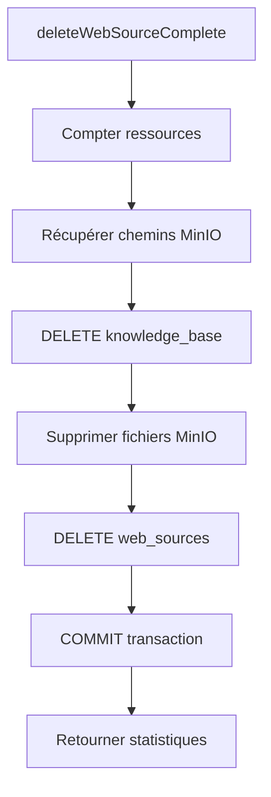

# Guide de Suppression Complète des Sources Web

Ce document explique comment fonctionne la suppression complète d'une source web, incluant tous ses documents de la knowledge base, fichiers, et données associées.

## 📋 Table des Matières

1. [Vue d'ensemble](#vue-densemble)
2. [Architecture de Suppression](#architecture-de-suppression)
3. [Utilisation](#utilisation)
4. [Détails Techniques](#détails-techniques)
5. [Considérations Importantes](#considérations-importantes)

---

## Vue d'ensemble

### Problème Résolu

Auparavant, la suppression d'une source web ne supprimait **PAS** les documents de la knowledge base créés à partir de cette source. Cela créait :

- ❌ **Données orphelines** dans la knowledge base
- ❌ **Chunks et embeddings obsolètes** dans le RAG
- ❌ **Fichiers MinIO** non supprimés
- ❌ **Consommation inutile** d'espace disque et PostgreSQL

### Solution Implémentée

Un nouveau service de suppression **complète** qui :

- ✅ Supprime les **documents Knowledge Base** (avec chunks et embeddings)
- ✅ Supprime les **fichiers MinIO** (PDFs, docs, images)
- ✅ Supprime les **pages web** (et métadonnées, versions, classifications)
- ✅ Supprime les **jobs et logs** de crawl
- ✅ Supprime la **source web** elle-même
- ✅ Fournit un **rapport détaillé** des suppressions
- ✅ Permet un **aperçu avant suppression**

---

## Architecture de Suppression

### Tables Affectées

#### 1. Knowledge Base (Niveau 1)
```
knowledge_base
├── metadata->>'sourceId' = source_id
└─> CASCADE → knowledge_base_chunks (embeddings inclus)
```

#### 2. Web Pages (Niveau 2)
```
web_pages (ON DELETE CASCADE depuis web_sources)
├─> web_page_metadata
├─> web_page_versions
├─> web_page_structured_metadata
├─> content_quality_assessments
├─> content_contradictions
├─> legal_classifications
└─> classification_corrections
```

#### 3. Autres Tables (ON DELETE CASCADE)
```
web_sources (suppression finale)
├─> web_crawl_jobs
├─> web_crawl_logs
├─> web_files
├─> crawler_health_metrics
├─> source_classification_rules
└─> web_source_ban_status
```

#### 4. Storage MinIO
```
Fichiers supprimés manuellement :
├─> web-files/* (fichiers crawlés)
└─> documents/* (documents KB)
```

### Diagramme de Flux



---

## Utilisation

### 1. Via API REST

#### Aperçu avant suppression (mode preview)

```bash
curl -X DELETE 'https://qadhya.tn/api/admin/web-sources/{id}?preview=true' \
  -H "Authorization: Bearer YOUR_TOKEN"
```

**Réponse :**
```json
{
  "preview": true,
  "sourceName": "9anoun.tn",
  "sourceUrl": "https://9anoun.tn",
  "stats": {
    "knowledgeBaseDocs": 15,
    "knowledgeBaseChunks": 320,
    "webPages": 94,
    "webFiles": 8,
    "crawlJobs": 12,
    "crawlLogs": 45,
    "minioFiles": 23
  },
  "estimatedSize": "12.5 MB"
}
```

#### Suppression réelle

```bash
curl -X DELETE 'https://qadhya.tn/api/admin/web-sources/{id}' \
  -H "Authorization: Bearer YOUR_TOKEN"
```

**Réponse :**
```json
{
  "message": "Source supprimée avec succès",
  "stats": {
    "knowledgeBaseDocs": 15,
    "knowledgeBaseChunks": 320,
    "webPages": 94,
    "webFiles": 8,
    "crawlJobs": 12,
    "crawlLogs": 45,
    "minioFiles": 23
  },
  "errors": []
}
```

### 2. Via Script CLI

#### Aperçu uniquement

```bash
npm run test:delete-source -- <source-id> --preview-only
```

**Exemple de sortie :**
```
📊 Récupération aperçu de suppression...

Source:
  Nom: 9anoun.tn
  URL: https://9anoun.tn
  ID:  550e8400-e29b-41d4-a716-446655440000

Ce qui sera supprimé:
  📚 Documents Knowledge Base:    15
  📄 Chunks KB (avec embeddings): 320
  🌐 Pages web:                   94
  📁 Fichiers web:                8
  🔄 Jobs de crawl:               12
  📋 Logs de crawl:               45
  💾 Fichiers MinIO:              23
  📏 Taille estimée:              12.5 MB

✅ Aperçu complété (mode --preview-only)
💡 Pour supprimer réellement, retirez --preview-only
```

#### Suppression avec confirmation

```bash
npm run test:delete-source -- <source-id>
```

Le script demandera confirmation :
```
⚠️  ATTENTION: Cette opération est IRRÉVERSIBLE!
⚠️  Toutes les données ci-dessus seront DÉFINITIVEMENT supprimées

Voulez-vous continuer? (tapez "OUI" en majuscules pour confirmer):
```

#### Suppression sans confirmation (automatique)

```bash
npm run test:delete-source -- <source-id> --confirm
```

### 3. Via Code TypeScript

```typescript
import { deleteWebSourceComplete, getDeletePreview } from '@/lib/web-scraper/delete-service'

// Aperçu avant suppression
async function previewDeletion(sourceId: string) {
  const preview = await getDeletePreview(sourceId)

  console.log(`Source: ${preview.sourceName}`)
  console.log(`Documents KB: ${preview.stats.knowledgeBaseDocs}`)
  console.log(`Pages: ${preview.stats.webPages}`)
  console.log(`Taille: ${preview.estimatedSize}`)
}

// Suppression complète
async function deleteSource(sourceId: string) {
  const result = await deleteWebSourceComplete(sourceId)

  if (result.success) {
    console.log('✅ Suppression réussie!')
    console.log(`Documents KB supprimés: ${result.stats.knowledgeBaseDocs}`)
    console.log(`Chunks supprimés: ${result.stats.knowledgeBaseChunks}`)

    if (result.errors.length > 0) {
      console.warn('⚠️ Erreurs rencontrées:', result.errors)
    }
  } else {
    console.error('❌ Échec suppression:', result.errors)
  }
}
```

---

## Détails Techniques

### Fonction `deleteWebSourceComplete()`

**Localisation :** `lib/web-scraper/delete-service.ts`

**Signature :**
```typescript
async function deleteWebSourceComplete(
  sourceId: string
): Promise<DeleteSourceResult>
```

**Type de retour :**
```typescript
interface DeleteSourceResult {
  success: boolean
  sourceDeleted: boolean
  stats: {
    knowledgeBaseDocs: number
    knowledgeBaseChunks: number
    webPages: number
    webFiles: number
    crawlJobs: number
    crawlLogs: number
    minioFiles: number
  }
  errors: string[]
}
```

### Fonction `getDeletePreview()`

**Signature :**
```typescript
async function getDeletePreview(sourceId: string): Promise<{
  sourceName: string
  sourceUrl: string
  stats: DeleteSourceResult['stats']
  estimatedSize: string
}>
```

### Ordre d'Exécution (Transaction PostgreSQL)

```sql
BEGIN;

-- 1. Compter les ressources (pour statistiques)
SELECT COUNT(*) FROM knowledge_base WHERE metadata->>'sourceId' = $1;
SELECT COUNT(*) FROM web_pages WHERE web_source_id = $1;
-- etc.

-- 2. Récupérer chemins fichiers MinIO
SELECT file_path FROM web_files WHERE web_source_id = $1;
SELECT source_file FROM knowledge_base WHERE metadata->>'sourceId' = $1;

-- 3. Supprimer documents KB (chunks supprimés en cascade)
DELETE FROM knowledge_base WHERE metadata->>'sourceId' = $1;

-- 4. Supprimer fichiers MinIO (hors transaction)
-- Effectué via API MinIO

-- 5. Supprimer source (tout le reste en cascade)
DELETE FROM web_sources WHERE id = $1;

COMMIT;
```

### Gestion des Erreurs

- ✅ **Transaction ACID** : Si une erreur survient, tout est rollback
- ✅ **Erreurs MinIO** : Collectées dans `result.errors` mais n'arrêtent pas le processus
- ✅ **Logging** : Toutes les erreurs sont loggées avec détails
- ✅ **Idempotence** : Peut être relancé en cas d'échec partiel

---

## Considérations Importantes

### ⚠️ Opération Irréversible

La suppression est **DÉFINITIVE** et **IRRÉVERSIBLE**. Les données suivantes seront perdues :

- 📚 Documents juridiques indexés dans la KB
- 🧠 Embeddings générés (peut prendre des heures à recréer)
- 📄 Pages web crawlées avec métadonnées
- 📁 Fichiers téléchargés (PDFs, docs)
- 🔍 Classifications et analyses de qualité
- 📊 Historique des crawls

### ✅ Bonnes Pratiques

1. **TOUJOURS** utiliser `--preview-only` ou `?preview=true` d'abord
2. **VÉRIFIER** les statistiques avant suppression
3. **CONFIRMER** avec l'équipe si source importante
4. **SAUVEGARDER** les données critiques si nécessaire
5. **DOCUMENTER** la raison de la suppression

### 🔒 Permissions Requises

- ✅ Rôle `admin` ou `super_admin` requis
- ✅ Session authentifiée valide
- ✅ Accès API autorisé

### 📈 Performance

**Temps estimé selon volume :**

| Pages | Chunks KB | Fichiers | Durée estimée |
|-------|-----------|----------|---------------|
| < 100 | < 500     | < 20     | ~2-5 secondes |
| 100-500 | 500-2000 | 20-100  | ~5-15 secondes |
| 500-1000 | 2000-5000 | 100-500 | ~15-30 secondes |
| > 1000 | > 5000   | > 500    | ~30-60 secondes |

**Facteurs influençant la durée :**
- Nombre de fichiers MinIO (1 appel API par fichier)
- Taille des chunks (DELETE + réindexation HNSW)
- Charge serveur PostgreSQL

### 🔍 Vérification Post-Suppression

Pour vérifier que tout a été supprimé :

```sql
-- Aucun document KB orphelin
SELECT COUNT(*) FROM knowledge_base
WHERE metadata->>'sourceId' = '<source-id>';
-- Devrait retourner 0

-- Aucune page web
SELECT COUNT(*) FROM web_pages
WHERE web_source_id = '<source-id>';
-- Devrait retourner 0

-- Source supprimée
SELECT COUNT(*) FROM web_sources
WHERE id = '<source-id>';
-- Devrait retourner 0
```

---

## Cas d'Usage

### 1. Source en Doublon

```bash
# Vérifier que c'est un doublon
npm run test:delete-source -- <source-id> --preview-only

# Supprimer avec confirmation
npm run test:delete-source -- <source-id>
```

### 2. Source Obsolète ou Invalide

```bash
# Exemple: Site web fermé ou changé de domaine
npm run test:delete-source -- <old-source-id> --confirm
```

### 3. Nettoyage Test/Dev

```bash
# Supprimer sources de test en masse (via API)
for id in source-1 source-2 source-3; do
  curl -X DELETE "http://localhost:7002/api/admin/web-sources/$id"
done
```

### 4. Migration vers Nouvelle Source

```bash
# 1. Créer nouvelle source avec config corrigée
# 2. Crawler nouvelle source
# 3. Vérifier qualité
# 4. Supprimer ancienne source
npm run test:delete-source -- <old-source-id> --confirm
```

---

## Dépannage

### Erreur: "Source non trouvée"

```
❌ Source non trouvée
```

**Cause :** L'ID fourni n'existe pas ou a déjà été supprimé.

**Solution :**
1. Vérifier l'ID : `SELECT id, name FROM web_sources;`
2. Vérifier qu'il n'a pas déjà été supprimé

### Erreur: "Erreur suppression MinIO"

```
⚠️ Erreurs rencontrées (3):
  - Erreur suppression MinIO web-files/abc.pdf: NoSuchKey
```

**Cause :** Fichier déjà supprimé manuellement ou chemin invalide.

**Impact :** Aucun - les erreurs MinIO sont collectées mais n'empêchent pas la suppression.

**Solution :** Ignorer si le fichier n'existe plus, ou investiguer si récurrent.

### Transaction Timeout

```
❌ Erreur transaction: query timeout
```

**Cause :** Trop de données à supprimer en une fois.

**Solution :**
1. Augmenter `statement_timeout` PostgreSQL temporairement
2. Ou supprimer en plusieurs étapes :
   ```sql
   -- Supprimer chunks par batch
   DELETE FROM knowledge_base_chunks
   WHERE knowledge_base_id IN (
     SELECT id FROM knowledge_base
     WHERE metadata->>'sourceId' = 'xxx'
     LIMIT 1000
   );
   ```

---

## Changelog

### Version 1.0.0 (Feb 10, 2026)

✨ **Nouveautés :**
- Suppression complète incluant knowledge base
- Aperçu avant suppression
- Statistiques détaillées
- Gestion erreurs MinIO
- Script CLI interactif

🔧 **Fichiers créés :**
- `lib/web-scraper/delete-service.ts` (389 lignes)
- `scripts/test-delete-source-complete.ts` (195 lignes)
- `docs/WEB_SOURCE_DELETION.md` (ce document)

📝 **Fichiers modifiés :**
- `app/api/admin/web-sources/[id]/route.ts` (ajout preview + stats)
- `lib/web-scraper/index.ts` (export nouveaux services)
- `package.json` (script npm `test:delete-source`)

---

## Ressources

- **Code source :** `lib/web-scraper/delete-service.ts`
- **API route :** `app/api/admin/web-sources/[id]/route.ts`
- **Script test :** `scripts/test-delete-source-complete.ts`
- **Schema DB :** `db/migrations/*.sql` (contraintes ON DELETE CASCADE)

## Support

Pour questions ou bugs :
1. Vérifier ce document d'abord
2. Consulter les logs d'erreur détaillés
3. Créer une issue GitHub avec :
   - ID source concernée
   - Stats aperçu
   - Erreurs complètes
   - Logs PostgreSQL + MinIO

---

**Dernière mise à jour :** 10 février 2026
**Auteur :** Claude Code
**Version :** 1.0.0
